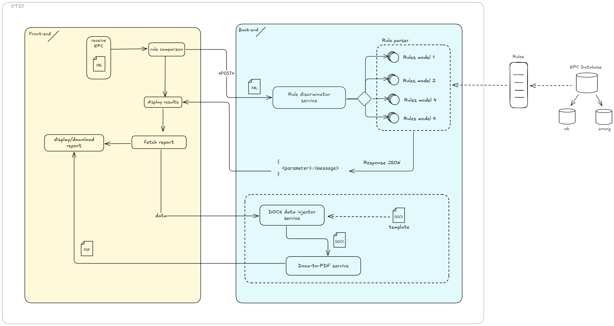

# MODERATE QUALITY CHECK REPORT TOOL

## Description

This tool allows users to upload an EPC (Energy Performance Certificate) in its standard XML format. The system then analyzes the file and identifies any inconsistencies or discrepancies found based on predefined rules.

The frontend, located in `src/front/`, handles all UI/UX-related functionality. This includes sending the XML document to the backend via a RESTful API and receiving the corresponding response.



To run the application, a Taskfile is used. This is an alternative to Makefile, written in YAML syntax. The defined tasks are "start," "stop," "build," and "logs." To execute these tasks, you can run the following command:

```sh
task build start logs
```

This will build the Docker image, run the system in the background using the docker-compose.yaml file, and finally display the logs in the console.

## EPC examples

The `epcs/` folder contains some anonymized examples. These can be used for development and testing purpouses.

## Back

The backend defines a set of REST endpoints to facilitate remote communication.
Currently, the implemented endpoint is located at the URI `/upload` and accepts only POST requests. The file to be analyzed should be included in the body of the request.

## Front

The frontend is currently a basic HTML page that makes a request to the /upload endpoint. It parses the file and returns the necessary HTML to display the content on the web page, which is then embedded directly after the response is received.

## Future developments

### Cadastre API Integration

In the future, the tool is intended to integrate with the Cadastre API to make HTTP GET requests to the following URI:

```
http://ovc.catastro.meh.es/OVCServWeb/OVCWcfCallejero/COVCCallejero.svc/json/Consulta_DNPRC?RefCat=5223603YJ2752C0006UD`
```

In the `cadaster/` folder, you can find an example XML response from the API, along with an XML file containing the field names and the XSD schema that defines the XML structure.


# Adding New Rules to the System

This document outlines the steps required to add new validation rules to the system. The process involves creating a JSON configuration file and a corresponding Python implementation that inherits from `BaseRule`.

## Steps to Add a New Rule

### 1. Create a JSON Configuration File
Each rule must have a corresponding JSON file located in the `rules_json` directory. The JSON file defines the rule's metadata and parameters.

#### Example JSON Structure:
```json
{
  "id": "rule_010",
  "type": "data_validation",
  "category": "common_rules",
  "class": "NewRuleClass",
  "description": "This rule ensures that a specific field meets certain conditions.",
  "parameters": {
    "xpath": "//SomeField",
    "expected_value": "ExpectedData"
  }
}
```

### 2. Implement the Rule in Python
Create a new Python file in the `rules` directory, following the naming convention `rule_<number>_<description>.py`.

#### Steps:
1. Import the necessary modules.
2. Inherit from `BaseRule`.
3. Decorate the class with `@register_rule_class`.
4. Initialize fields using values from the JSON configuration.
5. Implement the `validate` method to return a dictionary with `status`, `message`, `rule_id`, and any additional details.

#### Example Python Implementation:
```python
from .base_rule import BaseRule, register_rule_class
from typing import Dict

@register_rule_class
class NewRuleClass(BaseRule):
    def __init__(self, rule_data: Dict):
        super().__init__(rule_data)
        self.xpath = self.parameters.get("xpath")
        self.expected_value = self.parameters.get("expected_value")

    def validate(self, epc: "EpcDto") -> Dict:
        validation_result = {
            "status": "error",
            "rule_id": self.id,
            "message": "",
            "details": {}
        }

        field_value = epc.get_value_by_xpath(self.xpath)
        if field_value is None:
            validation_result["message"] = f"No value found for XPath: {self.xpath}"
            return validation_result

        if field_value != self.expected_value:
            validation_result["message"] = f"Expected '{self.expected_value}' but found '{field_value}'"
            return validation_result

        validation_result["status"] = "success"
        validation_result["message"] = f"Field '{self.xpath}' is correctly set to '{self.expected_value}'"
        return validation_result
```

## 3. Verify the Rule Registration
Ensure that the rule is properly registered and loaded by checking the output when running the application. The registered rules should appear in the logs.

### 4. Testing the Rule
To test the new rule:
1. Add test XML files containing expected and incorrect values.
2. Run the validation process and verify the results.
3. Ensure errors are correctly logged and handled.

#### Example Python Implementation:
```python
import json
import sys, os
path = os.path.abspath(os.path.join(os.path.dirname(__file__), '../src/back'))
sys.path.insert(0, path)

from rules.rule_001_data_validation_in_xlsx_rule import DataValidationInXlsxRule
from core.epc_dto import EpcDto

# Rutas a los directorios y archivos
DATA_DIR = os.path.join(path,"data")
CACHE_JSON_PATH = os.path.join(path,os.path.join("core","rules_cache.json"))
EPC_FILE_PATH = os.path.join(DATA_DIR, "1 Bloque de viviendas.xml")
EXCEL_FILE_PATH = os.path.join(DATA_DIR, "Listado Poblaciones Zonificación Climática Comunidad Valenciana.xlsx")

# Cargar el archivo EPC
with open(EPC_FILE_PATH, "r", encoding="utf-8") as epc_file:
    epc_content = epc_file.read()

# Crear una instancia de EpcDto
epc = EpcDto(epc_content)

# Cargar las reglas desde el JSON de caché
with open(CACHE_JSON_PATH, "r", encoding="utf-8") as cache_file:
    cache_data = json.load(cache_file)

# Buscar la regla de tipo 'DataValidationInXlsxRule'
rule_data = next(
    (rule for rule in cache_data["rules"]["common_rules"] if rule["class"] == "DataValidationInXlsxRule"),
    None
)

if not rule_data:
    raise ValueError("No se encontró una regla de tipo 'DataValidationInXlsxRule' en el JSON de caché.")

# Ajustar la ruta del archivo Excel en los parámetros de la regla
rule_data["parameters"]["valid_values_source"] = EXCEL_FILE_PATH

# Instanciar la regla
rule = DataValidationInXlsxRule(rule_data)

# Validar el documento EPC
result = rule.validate(epc)

# Imprimir el resultado
print(result)
```

## Workflow Diagram
Below is a simplified diagram illustrating the rule addition workflow:

```plaintext
+--------------------+
|  Create JSON File  |
+--------------------+
          |
          v
+-------------------------+
|  Implement Rule in Py   |
+-------------------------+
          |
          v
+---------------------------+
|  Register & Load Rule     |
+---------------------------+
          |
          v
+--------------------+
|  Run & Test Rule   |
+--------------------+
```

Following these steps ensures that the new rule is correctly integrated into the system, registered, and validated.


